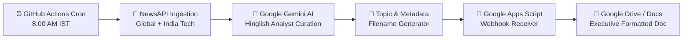

# 🌐 Tech World Daily Intelligence

[](https://github.com/build-with-anurag/daily-tech-briefing/actions/workflows/daily-briefing.yml)
[](https://www.python.org/)
[](https://ai.google.dev/)
[](LICENSE)

An automated, intelligent daily technology briefing pipeline designed for Indian tech enthusiasts, founders, builders, and developers. Every morning at **8:00 AM IST**, the pipeline fetches breaking global tech news and India ecosystem updates, curates the 6–8 most critical stories via **Google Gemini** in a crisp **Hinglish** conversational format, and formats a Google Doc saved directly into your **Google Drive**.

Zero server costs. Zero maintenance. 100% automated via **GitHub Actions**.

---

## 📌 Architecture & Data Flow



1. **Scheduled Trigger**: GitHub Actions triggers daily at `02:30 UTC` (8:00 AM IST) or manually via `workflow_dispatch`.
2. **Aggregated Ingestion**: Queries global tech headlines, Indian tech developments, and targeted queries for AI, semiconductors, quantum, startups, and sovereign compute.
3. **Editorial Intelligence**: Gemini filters the noise and prioritizes tier-1 lab moves (OpenAI, Google, Meta, Anthropic, Microsoft, Apple), AI research, Indian deep-tech funding, and infrastructure shifts.
4. **Automated Publishing**: Formatted markdown is sent to a custom Google Apps Script endpoint that parses the markdown, applies custom typography, and saves the file in your Google Drive folder.

---

## ✨ Features

- **🎯 Priority-First Curation**: Focuses on high-impact announcements, model releases, funding rounds, and semiconductor policies rather than filler news.
- **🇮🇳 Conversational Hinglish Voice**: Written like a sharp tech analyst friend texting you: *Seedhi baat, no jargon, thoda witty*.
- **📊 Strict 4-Field Story Breakdown**:
  - **Headline**: High-density title carrying concrete numbers and names.
  - **Kya hua**: 2–3 factual lines with names, figures, and launch details.
  - **Background**: 1 line of essential context.
  - **Kyun matter karta hai**: Industry impact with an India angle wherever applicable.
  - **Source**: Verified, direct source link from the stream.
- **💡 "Aaj ki ek baat"**: A closing macro takeaway summarizing the day's overarching tech shift.
- **📑 Styled Google Docs**: The Google Apps Script formats headers, bolds key labels, highlights key quotes, and formats URLs automatically.

---

## 📋 Sample Output Preview

```markdown
🌐 TECH WORLD DAILY INTELLIGENCE
Date: September 30, 2026
Topic: OpenAI Orion Preview, Tata Semiconductor Plant & Meta Llama 4 Infra

**1. OpenAI Announces Next-Gen Reasoning Architecture with 10x Compute Scale**
Kya hua: OpenAI ne introduce kiya naya flagship model Jo complex multi-step reasoning aur coding benchmarks me SOTA achieve karta hai. Global enterprise rollout agle hafte se start hoga.
Background: Pichle 6 mahine se frontier labs compute efficiency aur inference scaling pe heavy focus kar rahi thi.
Kyun matter karta hai: Enterprise AI agent deployment speed 3x ho sakti hai. Indian IT services companies ke automation contracts ke liye yeh game-changer hai.
Source: [TechCrunch](https://techcrunch.com/...)

...

💡 Aaj ki ek baat: Inference compute is becoming the new currency — labs ab training se zyada reasoning-time compute optimize karne me race laga rahi hain.
```

---

## 🚀 Quickstart & Setup Guide

### Prerequisites

- A [GitHub](https://github.com/) account
- A free [NewsAPI](https://newsapi.org/) API key
- A free [Google AI Studio (Gemini)](https://aistudio.google.com/) API key
- A Google account (for Google Drive & Google Apps Script)

---

### Step 1: Fork or Clone the Repository

```bash
git clone https://github.com/build-with-anurag/daily-tech-briefing.git
cd daily-tech-briefing
```

---

### Step 2: Setup Google Apps Script Webhook

1. Open [Google Drive](https://drive.google.com/) and create a folder (e.g., `Daily Tech Briefings`).
2. Copy the **Folder ID** from your browser address bar:

   ```text
   https://drive.google.com/drive/folders/YOUR_FOLDER_ID_HERE
   ```

3. Go to [script.google.com](https://script.google.com/) and click **New project**.
4. Replace the default code with the contents of [`google_apps_script.js`](google_apps_script.js).
5. Update `FOLDER_ID` near the top of the script with your target Folder ID:

   ```javascript
   var FOLDER_ID = "YOUR_FOLDER_ID_HERE";
   ```

6. Click **Deploy** → **New deployment**:
   - Select type: **Web app**
   - Execute as: **Me**
   - Who has access: **Anyone** *(Allows GitHub Actions to post content)*
7. Click **Deploy**, authorize permissions, and copy the **Web app URL**.

---

### Step 3: Configure GitHub Secrets

Navigate to your repository on GitHub:
**Settings → Secrets and variables → Actions → New repository secret**

Add the following three repository secrets:

| Secret Name | Description | Source |
| --- | --- | --- |
| `NEWS_API_KEY` | Ingests technology and startup news | [newsapi.org](https://newsapi.org/) |
| `GEMINI_API_KEY` | Generates intelligence briefings | [aistudio.google.com](https://aistudio.google.com/) |
| `DRIVE_WEBHOOK_URL` | Webhook URL from Step 2 | Google Apps Script Web App Deployment |

---

### Step 4: Run & Test the Automation

1. In your GitHub repository, click the **Actions** tab.
2. Select **Daily Tech Briefing** from the left sidebar.
3. Click **Run workflow** → **Run workflow**.
4. Once completed (typically ~30-45 seconds), check your Google Drive folder: your formatted Google Doc briefing is ready! 🎉

---

## 💻 Local Development & Testing

You can run and test the script locally on your machine:

```bash
# Clone and enter repo
git clone https://github.com/build-with-anurag/daily-tech-briefing.git
cd daily-tech-briefing

# Install dependencies
pip install -r requirements.txt

# Set environment variables (Bash)
export NEWS_API_KEY="your_newsapi_key"
export GEMINI_API_KEY="your_gemini_api_key"
export DRIVE_WEBHOOK_URL="your_apps_script_url"

# Or on Windows (PowerShell)
$env:NEWS_API_KEY="your_newsapi_key"
$env:GEMINI_API_KEY="your_gemini_api_key"
$env:DRIVE_WEBHOOK_URL="your_apps_script_url"

# Run the briefing pipeline
python main.py
```

---

## ⚙️ Customization

### Changing the Schedule

The cron schedule is defined in [`.github/workflows/daily-briefing.yml`](.github/workflows/daily-briefing.yml):

```yaml
schedule:
  # 02:30 UTC = 08:00 AM IST
  - cron: "30 2 * * *"
```

Modify the cron string to adjust the delivery time to your preferred timezone.

### Changing the Gemini Model

By default, the script uses `gemini-3.8-flash` with automatic fallback to other flash models (`gemini-3.5-flash`, `gemini-3.7-flash`, `gemini-2.5-flash`). You can override this by setting a `GEMINI_MODEL` environment variable or GitHub secret.

---

## 📁 Project Structure

```text
daily-tech-briefing/
├── .github/
│   └── workflows/
│       └── daily-briefing.yml   # GitHub Actions scheduled workflow
├── .gitignore                   # Ignored files & secrets
├── google_apps_script.js        # Google Docs styling & webhook receiver
├── main.py                      # News ingestion, Gemini prompt & upload pipeline
├── requirements.txt             # Python dependencies (requests)
└── README.md                    # Project documentation
```

---

## 🛡️ Security & Privacy

- **Zero Credential Storage**: All sensitive keys (`NEWS_API_KEY`, `GEMINI_API_KEY`, `DRIVE_WEBHOOK_URL`) are loaded dynamically through environment variables and GitHub Secrets — never hardcoded into code.
- **Header-Based Authentication**: API keys are transmitted via secure HTTP request headers (`x-goog-api-key` and `X-Api-Key`), ensuring secrets never appear in query strings, URL parameters, proxy logs, or exception stack traces.
- **Sanitized Deduplication**: Titles and articles with removed or empty contents are pruned prior to model ingestion.

---

## 🤝 Contributing

Contributions, feedback, and feature suggestions are welcome!

1. Fork the Project
2. Create your Feature Branch (`git checkout -b feature/AmazingFeature`)
3. Commit your Changes (`git commit -m 'Add some AmazingFeature'`)
4. Push to the Branch (`git push origin feature/AmazingFeature`)
5. Open a Pull Request

---

## 📜 License

Distributed under the MIT License. See `LICENSE` for more information.

---

**Built with ❤️ for tech enthusiasts & builders.**
